使用接口层级的方式实现对starrocks集群进行账号、权限、库表授权管理。

---

1. 支持权限授予、权限回收，例如：ALTER,DROP,SELECT,INSERT,EXPORT,UPDATE,DELETE,CREATE_TABLE,CREATE_VIEW,CREATE_FUNCTION,CREATE_MATERIALIZED_VIEW,CREATE_ROW_ACCESS_POLICY,CREATE_MASKING_POLICY...
2. 支持账号创建、账号回收
3. 支持创建库
4. 支持Apache Ranger

---

<u>**配置文件说明：**</u>

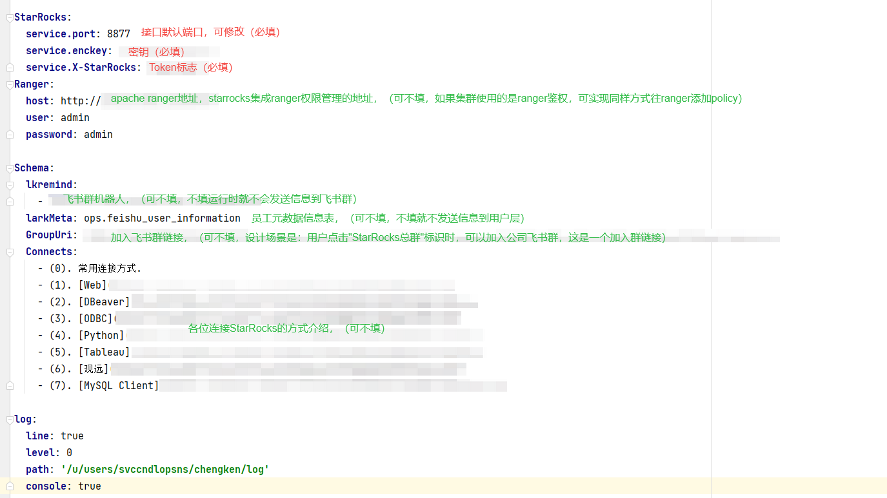

点击查看：[StarRocksDict.yaml](StarRocksDict.yaml)

<u>**密钥的生成说明：**</u>

为什么要加这一层？因为作为一个接口，并不是所有的请求都会处理，只有具备token的请求，才进行响应，否则将拒绝响应。

这里用到加密工具：[encpass2.0](https://github/com/chengkenli/encpass2.0)，自取

假如配置密钥：

service.enckey: bigdatastarrocks
service.X-StarRocks: StarRocks

生成请求密钥：

lenght       : 16
enckey       : bigdatastarrocks
enc password : 7bzI5uM+N1gl6hu9laotNQ==

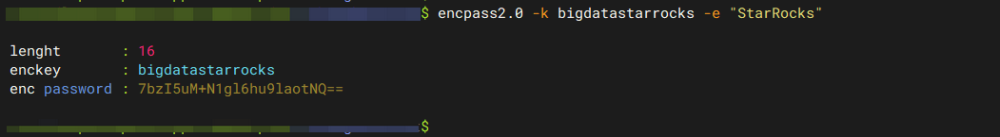

那么，发起http请求时，需要带上 -H "X-StarRocks: 7bzI5uM+N1gl6hu9laotNQ=="，否则校验失败，报非管理员不可使用，并打回请求。

**<u>"密钥HEAD为空，您无权使用管理员POST功能！！"</u>**

1. 配置密钥选项：
   
   `StarRocks:
     service.port: 8876
     service.enckey: bigdatastarrocks
     service.X-StarRocks: StarRocks`

2. 服务正式启动
   
   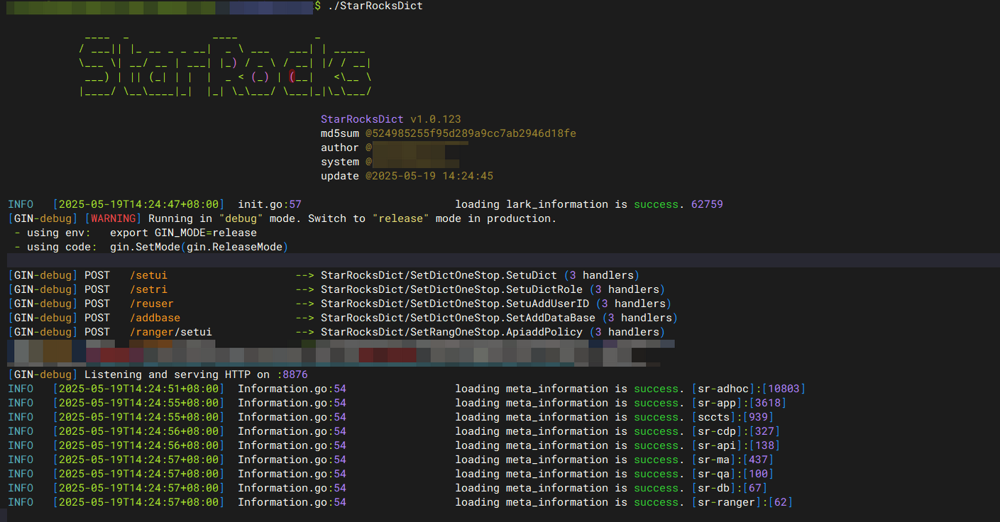

3. 尝试发起请求
   
   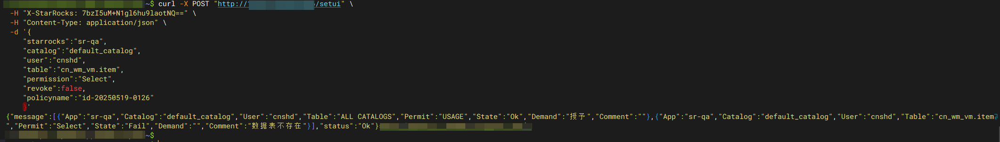
   
   `curl -X POST "http://xxx:8876/setui" \
    -H "X-StarRocks: 7bzI5uM+N1gl6hu9laotNQ==" \
    -H "Content-Type: application/json" \
    -d '{
   
       "starrocks":"sr-qa",
       "catalog":"default_catalog",
       "user":"cnshd",
       "table":"cn_wm_vm.item",
       "permission":"Select",
       "revoke":false,
       "policyname":"id-20250519-0126"
       }'`
   
   当密钥不正确时，则拒绝访问。
   
   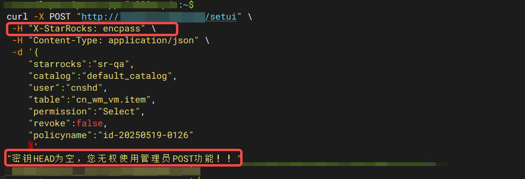

例子：

<u>**REQUEST**:</u>

curl -X POST "http://<IP>:<PORT>/<API>"\
     -H "X-StarRocks: <TOKEN>"\
     -H "Content-Type: application/json"\
     -d '<JSON BODY>'

<u>**DESCRIPTION**:</u>
<u>IP</u>：当前运行接口程序的机器IP。
<u>PORT</u>：端口默认8877，可在配置文件service.port中进行修改。
<u>API</u>：方法，具体有[/ranger/setui] | [/setui] | [/reuser] | [/addbase] | [/setri]。
<u>TOKEN</u>：密钥，这是一个防爆破密钥，填在请求header中，可在配置文件service.X-StarRocks中修改，在配置文件中会根据service.enckey值进行强加密，加解密方式在util/enc.go中有详解。
<u>JSON_BODY</u>：请求体，如下各项功能介绍所示

---

功能：

1. native权限授权、权限撤回（/setui）

2. 账号新建与删除管理（/reuser）

3. 数据库添加与调整分配额（/addbase）

4. 角色权限授权、权限撤回（/setri）

5. apache ranger权限授权、权限撤回（/ranger/setui）

---

**Apache Ranger**
http://<IP>:<PORT>/ranger/setui
`curl -X POST "http://<IP>:<PORT>/ranger/setui" \
 -H "X-StarRocks: <TOKEN>"                      \
 -H "Content-Type: application/json"            \
 -d '{
     "starrocks":"sr-adhoc",
     "catalog":"default_catalog",
     "user":"scnshs",
     "table":"cn_wm_repl_vm.grs_fulfillment_parm, cn_wm_repl_vm.channel_mthd_txt, cn_wm_vm.item_dc, cn_wm_vm.item, cn_wm_repl_vm.grs_filtered_order",
     "permission":"Select",
     "revoke":false,
     "policyname":"<no>"
    }'`

前提条件：FE开启ranger接管鉴权

`#ranger access
access_control = ranger`

已经配置接管

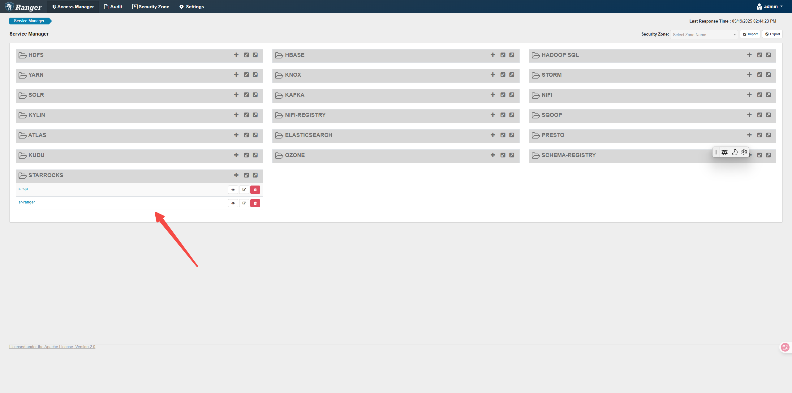

最原始的状态

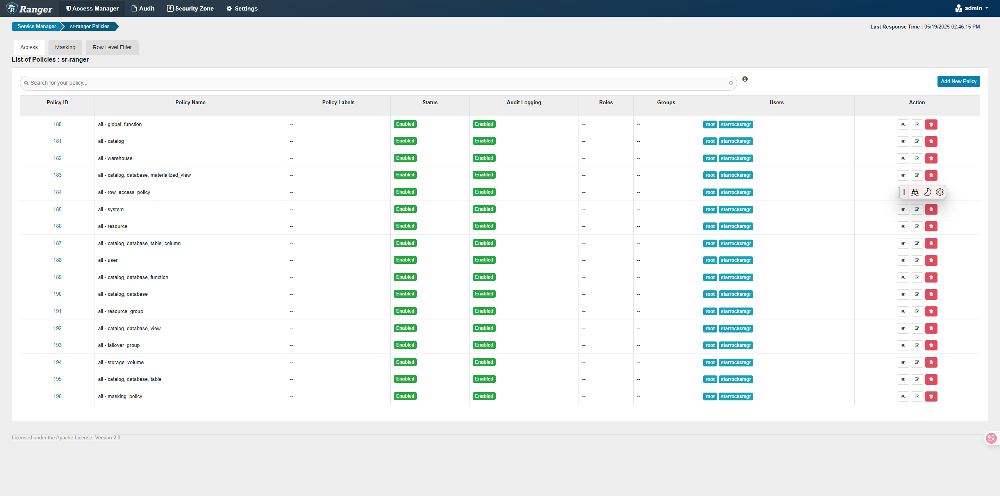

需求：对test1账号授予cn_wm_vm.item,cn_wm_vm.d1,cn_wm_vm.d2表的Select,Alter权限，那么结构体如下：

`curl -X POST "http://xxx:8876/ranger/setui" \
 -H "X-StarRocks: 7bzI5uM+N1gl6hu9laotNQ==" \
 -H "Content-Type: application/json" \
 -d '{
    "starrocks":"sr-ranger",
    "catalog":"default_catalog",
    "user":"cnshd",
    "table":"cn_wm_vm.item,cn_wm_vm.d1,cn_wm_vm.d2",
    "permission":"Select,Alter",
    "revoke":false,
    "policyname":"id-20250519-0001"
    }'`

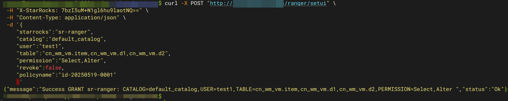

服务日志（自动创建policy）：

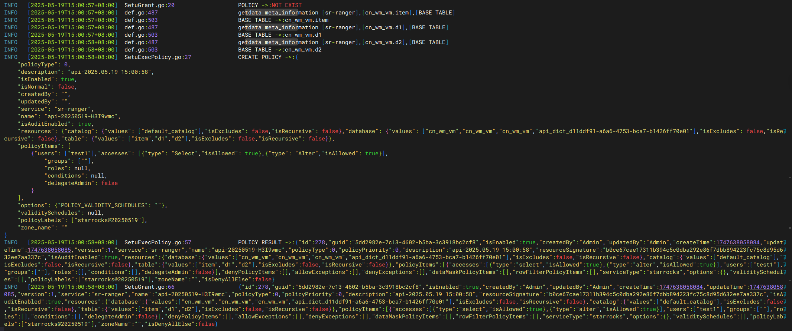

ranger界面：

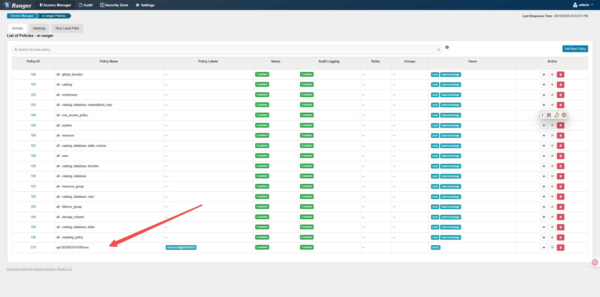

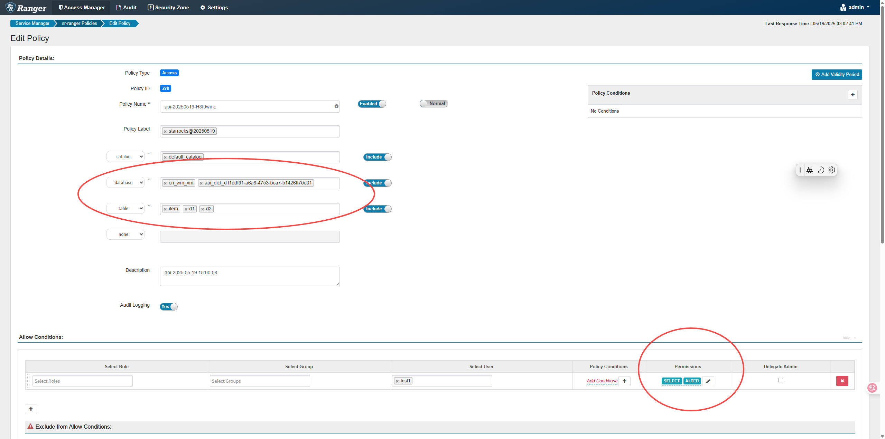

已经赋予权限。

其他：

**账号增删**
http://<IP>:<PORT>/reuser
`curl -X POST "http://<IP>:<PORT>/reuser" \
 -H "X-StarRocks: <TOKEN>"                \
 -H "Content-Type: application/json"      \
 -d '{
     "starrocks":"sr-qa",
     "user":"scnshs1",
     "owner":"c0l0f9l",
     "ldap":false,
     "option":"create",
     "policyname":"create-20250512-0002"
    }'`

`{
    "starrocks":"<app>",#集群名称
    "user":"<user>",#账号
    "owner":"<owner>",#责任人，填写责任人名称后，该用户会收到相关的邮件，账号密码。
    "ldap":<true>|<false>,#true，代表创建ldap类型账号、false，代表创建native类型账号
    "option":"<create>|<reset>|<drop>",#create创建账号、reset重置密码、drop删除账号
    "policyname":"<label>"#标识，可不填，可填工单号
} `

**权限管理**
http://<IP>:<PORT>/setui
`curl -X POST "http://<IP>:<PORT>/setui"  \
 -H "X-StarRocks: <TOKEN>"                \
 -H "Content-Type: application/json"      \
 -d '{
       "starrocks":"sr-adhoc",
       "catalog":"default_catalog",
       "user":"scnshs",
       "table":"cn_wm_repl_vm.grs_fulfillment_parm",
       "permission":"Select",
       "revoke":false,
       "policyname":"Request-20250512-0002"
     }'`

`{
    "starrocks":"<app>",#集群名称
    "catalog":"<catalog>",#catalog名称，[default_catalog]|[iceberg]|[hive]|[jdbc catalog name...]
    "user":"<user1>,<user2>...",#账号，支持多个账号
    "table":"<schema.tablename1>,<schema.tablename2>...",#库表，支持多个库表
    "permission":"<SELECT,ALTER...>",#权限，支持多个权限
    "revoke":<true>|<false>,#true，代表撤销权限，false，代表赋予权限
    "policyname":"<label>"#标识，可不填，可填工单号
}`

<u>解析：对sr-adhoc集群中的scnshs,test2这两个账号授予default_catalog下面cn_wm_repl_vm.grs_fulfillment_parm, cn_wm_repl_vm.channel_mthd_txt, cn_wm_vm.item_dc, cn_wm_vm.item, cn_wm_repl_vm.grs_filtered_order 这五个表的查询权限和删除权限。</u>

<u>REQUEST:</u>
`curl -X POST "http://<IP>:<PORT>/setui"    \
     -H "X-StarRocks: <token>"              \
     -H "Content-Type: application/json"    \
     -d '{
           "starrocks":"sr-adhoc",
           "catalog":"default_catalog",
           "user":"scnshs",
           "table":"cn_wm_repl_vm.grs_fulfillment_parm, cn_wm_repl_vm.channel_mthd_txt, cn_wm_vm.item_dc, cn_wm_vm.item, cn_wm_repl_vm.grs_filtered_order",
           "permission":"Select",
           "revoke":false,
           "policyname":"<no>"
         }'`

<u>REPONSE:</u>

`{
    "message": [
        {
            "App": "sr-adhoc",
            "Catalog": "default_catalog",
            "User": "scnshs",
            "Table": "ALL CATALOGS",
            "Permit": "USAGE",
            "State": "Ok",
            "Demand": "授予",
            "Comment": ""
        },
        {
            "App": "sr-adhoc",
            "Catalog": "default_catalog",
            "User": "scnshs",
            "Table": "cn_wm_repl_vm.grs_filtered_order",
            "Permit": "Select",
            "State": "Ok",
            "Demand": "授予",
            "Comment": ""
        },
        {
            "App": "sr-adhoc",
            "Catalog": "default_catalog",
            "User": "scnshs",
            "Table": "cn_wm_vm.item_dc",
            "Permit": "Select",
            "State": "Ok",
            "Demand": "授予",
            "Comment": ""
        },
        {
            "App": "sr-adhoc",
            "Catalog": "default_catalog",
            "User": "scnshs",
            "Table": "cn_wm_repl_vm.channel_mthd_txt",
            "Permit": "Select",
            "State": "Ok",
            "Demand": "授予",
            "Comment": ""
        },
        {
            "App": "sr-adhoc",
            "Catalog": "default_catalog",
            "User": "scnshs",
            "Table": "cn_wm_vm.item",
            "Permit": "Select",
            "State": "Ok",
            "Demand": "授予",
            "Comment": ""
        },
        {
            "App": "sr-adhoc",
            "Catalog": "default_catalog",
            "User": "scnshs",
            "Table": "cn_wm_repl_vm.grs_fulfillment_parm",
            "Permit": "Select",
            "State": "Ok",
            "Demand": "授予",
            "Comment": ""
        }
    ],
    "status": "Ok"
}`

LOG:
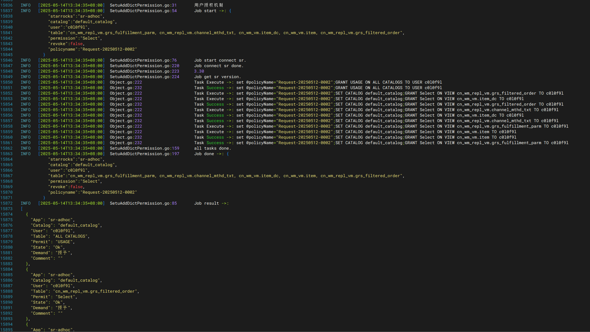
如配置了飞书应用机器人，scnshs用户亦会收到机器人发送的消息，如下：
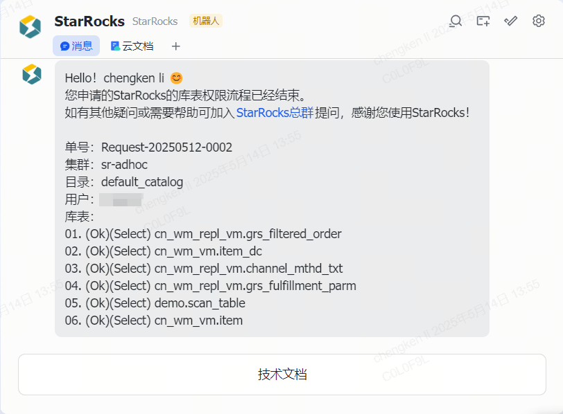

---

程序依赖配置表：
`-- db.starrocks_information_connections definition
CREATE TABLE starrocks_information_connections (
  app varchar(100) CHARACTER SET utf8mb4 COLLATE utf8mb4_0900_ai_ci NOT NULL COMMENT '集群名称(英文)',
  nickname varchar(100) CHARACTER SET utf8mb4 COLLATE utf8mb4_0900_ai_ci DEFAULT NULL COMMENT '别名',
  alias varchar(100) CHARACTER SET utf8mb4 COLLATE utf8mb4_0900_ai_ci DEFAULT NULL COMMENT '集群别名',
  feip varchar(200) CHARACTER SET utf8mb4 COLLATE utf8mb4_0900_ai_ci NOT NULL COMMENT '集群连接地址(必填)F5,VIP,CLB,FE',
  user varchar(200) CHARACTER SET utf8mb4 COLLATE utf8mb4_0900_ai_ci NOT NULL COMMENT '集群登录账号(必填) 建议是管理员角色的账号',
  password varchar(500) CHARACTER SET utf8mb4 COLLATE utf8mb4_0900_ai_ci NOT NULL COMMENT '集群登录密码(必填)',
  feport int NOT NULL DEFAULT '9030' COMMENT '集群登录端口，默认9030',
  address varchar(500) CHARACTER SET utf8mb4 COLLATE utf8mb4_0900_ai_ci DEFAULT NULL COMMENT 'MANAGER地址，如果填了MANAGER地址，那么将触发定时检查LICENSE是否过期(企业级)',
  expire int DEFAULT '30' COMMENT 'LICENSE是否过期(企业级)过期提醒倒计时，单位day',
  status int NOT NULL DEFAULT '0' COMMENT 'LICENSE是否过期(企业级)开关,0 off, 1 on',
  fe_log_path varchar(500) CHARACTER SET utf8mb4 COLLATE utf8mb4_0900_ai_ci DEFAULT NULL COMMENT 'FE 日志目录',
  be_log_path varchar(500) CHARACTER SET utf8mb4 COLLATE utf8mb4_0900_ai_ci DEFAULT NULL COMMENT 'BE 日志目录',
  be_meta_log varchar(200) DEFAULT NULL,
  java_udf_path varchar(500) CHARACTER SET utf8mb4 COLLATE utf8mb4_0900_ai_ci DEFAULT NULL COMMENT 'BE 日志目录',
  manager_access_key varchar(500) CHARACTER SET utf8mb4 COLLATE utf8mb4_0900_ai_ci DEFAULT NULL COMMENT 'manager 开发者的access key',
  manager_secret_key varchar(500) CHARACTER SET utf8mb4 COLLATE utf8mb4_0900_ai_ci DEFAULT NULL COMMENT 'manager 开发者的secret key',
  updated_at timestamp NULL DEFAULT CURRENT_TIMESTAMP ON UPDATE CURRENT_TIMESTAMP COMMENT '更新时间'
) ENGINE=InnoDB DEFAULT CHARSET=utf8mb4 COLLATE=utf8mb4_0900_ai_ci COMMENT='StarRocks登录配置，manager地址,(定期检查license过期日期)';`

---

`INSERT INTO db.starrocks_information_connections (app, nickname, alias, feip, user, password, feport, address, expire, status, fe_log_path, be_log_path, be_meta_log, java_udf_path, manager_access_key, manager_secret_key, updated_at) VALUES('sr-ranger', 'StarRocks(Tencent Cloud) SR-RangerQa', NULL, 'FE连接地址', 'root', '密码', 9030, 'http://xxx:19321', 30, 1, NULL, NULL, NULL, NULL, NULL, NULL, '2025-04-23 18:00:05');`

---

@ https://github.com/chengkenli/StarRocksDict
